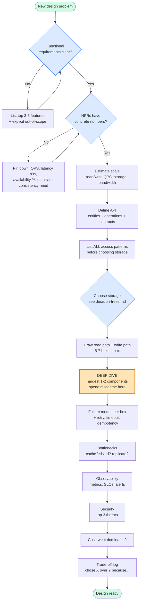

# Design Framework

A practical playbook for designing any system. Built for action, not reading.

> **Viewing the diagrams (VS Code):**
> 1. Open this repo in VS Code → accept the prompt to install the recommended *Markdown Preview Mermaid Support* extension. *(Or install manually: `code --install-extension bierner.markdown-mermaid`)*
> 2. Open any `.md` file in this folder.
> 3. Press **`Ctrl+Shift+V`** to open the preview pane — diagrams render inline.
> 4. Tip: **`Ctrl+K V`** opens the preview side-by-side with the source.

---

## How to use this folder

1. Open `worksheet.md` and **copy it** into a new file for the system you're designing.
2. Walk **the main flow graph** below, top to bottom. At each node, fill the matching worksheet section.
3. When you hit a decision (storage? sync vs async? cache?), open `decision-trees.md` and walk the tree for that decision.
4. Stuck or unsure how it all fits? Read `examples/01-url-shortener.md` — same worksheet, fully filled in.

After 2–3 systems, this becomes muscle memory and you won't need to look at the worksheet.

---

## The main flow

**Read this graph as a checklist.** The orange node (Deep Dive) is where most of the design work actually happens — don't rush to it, but don't skip it either.

---

## Time budgeting (45-min design session)

| Phase | Time | Why |
|---|---|---|
| 1. Clarify requirements | 5 min | Bad inputs → bad design. Push back on vagueness. |
| 2. Scale estimate | 3 min | Numbers gate every later choice. |
| 3. API + data model | 10 min | Access patterns drive storage. |
| 4. High-level diagram | 5 min | One pass, don't perfect it. |
| **5. Deep dive** | **15 min** | **The actual design work.** |
| 6. Bottlenecks + failures | 5 min | Where it breaks. |
| 7. Observability + cost + trade-offs | 2 min | Wrap up. |

In an interview, this matches a 45-minute slot. In real work, multiply each phase by 5–10× and revisit over days.

---

## Files in this folder

- `README.md` — this file. The main flow + how to use.
- `worksheet.md` — blank fill-in template. **Copy this** for each new design.
- `decision-trees.md` — visual decision graphs for the recurring choices (storage, sync/async, consistency, cache, sharding, build/buy).
- `examples/01-url-shortener.md` — first worked example. Add `02-…`, `03-…` as you design more.

---

## Folder convention

All Design Framework knowledge, decisions, examples, and notes live in this folder only. Same rule applies to every top-level folder in the repo — each is fully self-contained for its topic.
