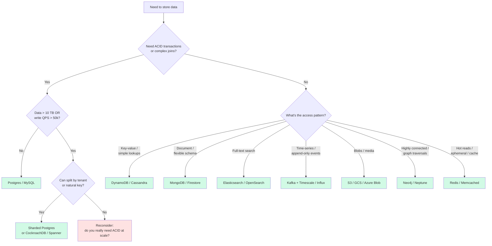
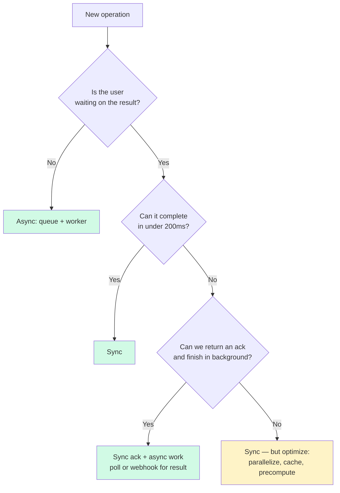
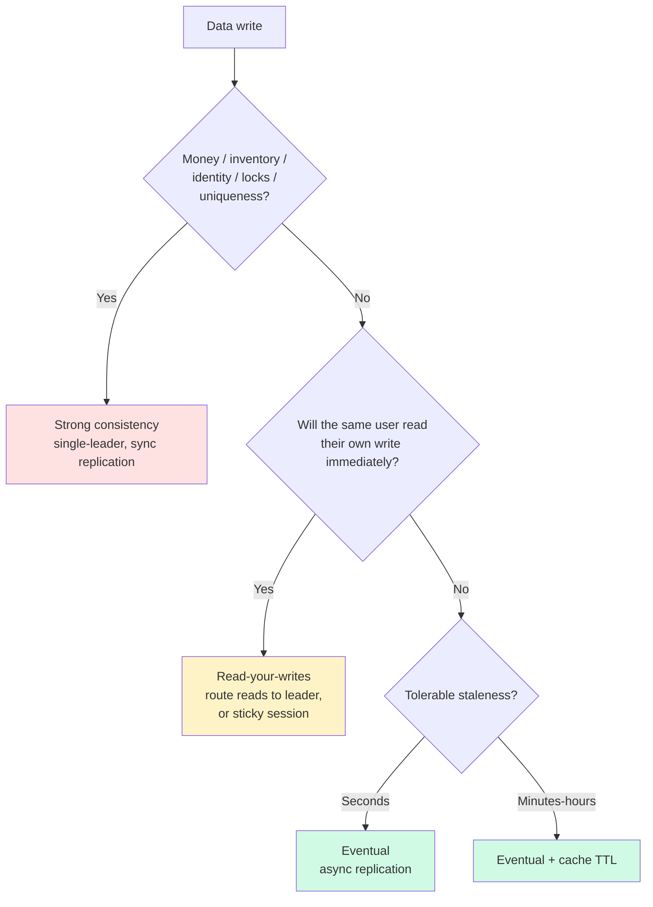
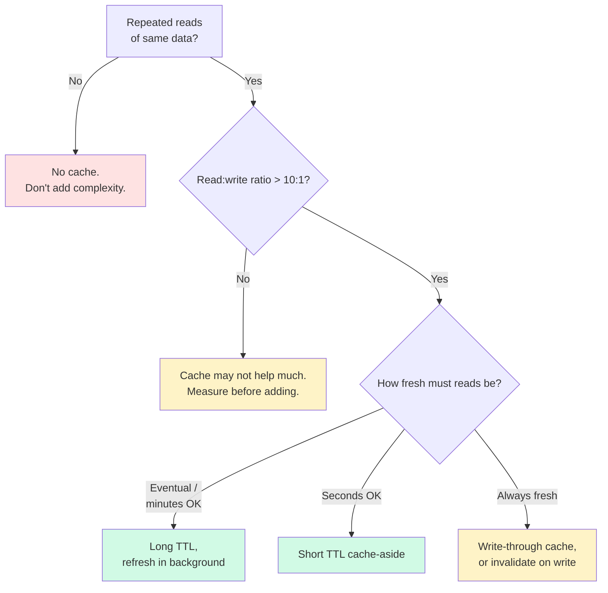
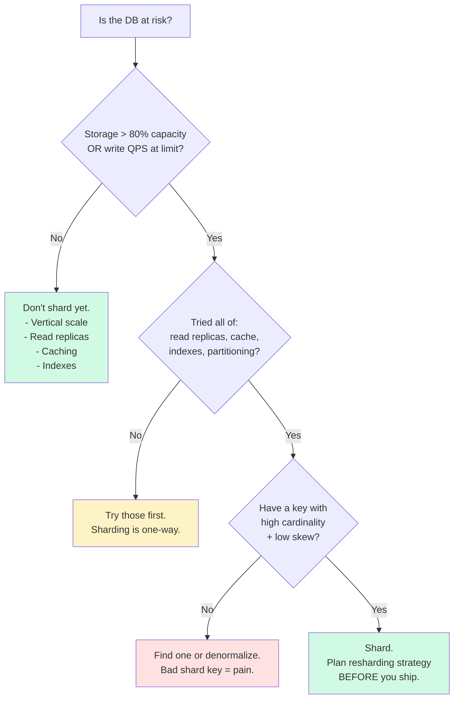
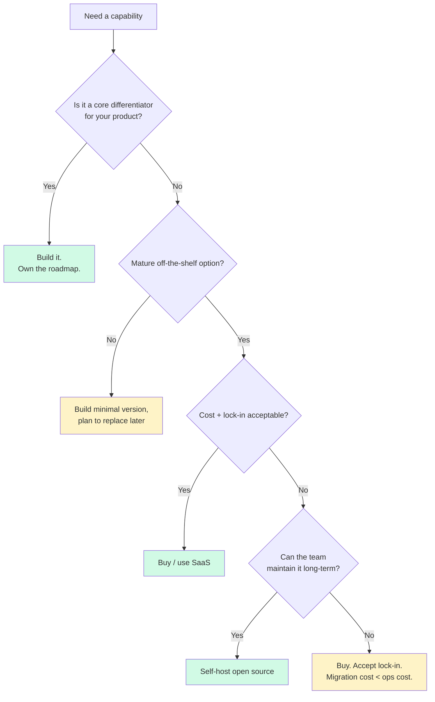

# Decision Trees

Visual tie-breakers for the recurring decisions in any design. Walk the relevant tree from top to bottom while filling the worksheet.

---

## 1. Storage choice

**Heuristic:** start with Postgres unless you have a concrete reason not to. It scales further than people think.

---

## 2. Sync vs async

**Rule of thumb:** anything > 200ms with a user waiting needs to become an ack-and-poll pattern.

---

## 3. Consistency level

**Cost order:** strong > read-your-writes > eventual. Default to eventual unless the use case demands stronger.

---

## 4. Cache strategy

**Where to cache** (cheapest to most expensive miss):
client → CDN → app-local → distributed cache (Redis) → DB query cache

---

## 5. When to shard

**Bad shard keys:** timestamp (hot tail), low-cardinality enums, anything skewed (one big tenant).
**Good shard keys:** user_id, tenant_id, hash of natural key.

---

## 6. Build vs buy

---

## 7. Cross-cutting tradeoff matrix

For decisions that don't deserve a full tree:

| Question | Lean A when… | Lean B when… |
|---|---|---|
| **Push vs pull** | Low-latency notify, few consumers | Many consumers, batching OK |
| **Stateful vs stateless** | Sticky sessions, in-memory state | Need easy horizontal scale |
| **Monolith vs microservices** | Small team, early stage, tight coupling | Many teams, independent deploys |
| **Pessimistic vs optimistic lock** | High contention, short txn | Low contention, long txn |
| **Leader-follower vs multi-leader** | One source of truth, simpler | Multi-region writes, conflict-tolerant |
| **CAP under partition** | CP: banking, locks, inventory | AP: feeds, social, search |
| **REST vs gRPC** | Public API, browser clients | Internal, low-latency, typed |
